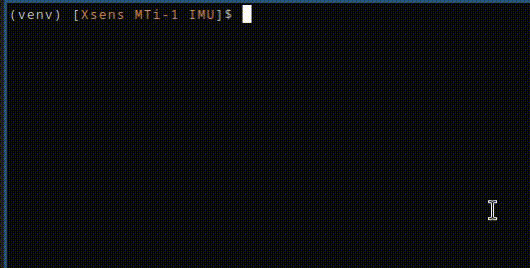

# Xsens MTi-1 IMU accelerometer data

Repo contains simple script for getting accelerometer data from Xsens MTi-1 IMU sensor.

## Build and run

```bash
python3 -m venv venv
source venv/bin/activate
pip install -r requirements.txt
python main.py
```

## Output


